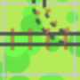
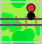
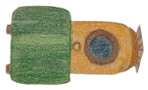

# Happy Train 🚂

A puzzle-based train simulator game where each level presents a unique challenge to guide trains to their destinations safely.

### [Direct link to the game](http://dmitryweiner.github.io/happy-train)

## 🎮 Game Overview

Happy Train is a browser-based puzzle game that combines strategic thinking with railroad management. Players control switches and semaphores to guide trains through complex track layouts, avoiding derailments and ensuring safe arrival at destination stations.

## ✨ Features

### Core Gameplay
- **Puzzle-based levels**: Each level is a unique challenge with different track layouts
- **Switch control**: Click on switches to change track directions
- **Semaphore management**: Control traffic lights to stop and start trains
- **Multiple trains**: Some levels feature multiple trains that must be coordinated
- **Collision avoidance**: Prevent train crashes and derailments
- **Progressive difficulty**: Levels increase in complexity

### Technical Features
- **HTML5 Canvas rendering**: Smooth graphics with pixel art aesthetic
- **Progress saving**: Game automatically saves your current level
- **Pause functionality**: Game pauses when window loses focus
- **Level editor**: Built-in editor for creating custom levels
- **Visual testing**: Comprehensive test suite for graphics consistency
- **Responsive design**: Optimized for desktop browsers

## 🕹️ How to Play

### Controls
- **Scroll wheel** (or pinch on touch) on the game board to zoom the picture inside the fixed field window (about **100%–300%**); **drag** to pan when zoomed in
- **Click switches**  to change track directions
- **Click semaphores**  to stop/start trains
- **Click level number** to pause/unpause the game

### Objectives
1. Guide the train(s) to the destination station 
2. Avoid derailments and collisions
3. Use switches to direct trains along the correct path
4. Control semaphores to manage train timing
5. Complete all levels to win!

### Game Elements
- **Locomotive** : The engine that pulls the train
- **Wagons**  : Cargo cars attached to the locomotive
- **Switches**: Junction points where tracks split - click to toggle direction
- **Semaphores**: Traffic signals that can stop trains when closed
- **Stations**: Destination points where trains must arrive

## 🚀 Getting Started

### Prerequisites
- Modern web browser with HTML5 Canvas support
- Desktop environment recommended (mobile warning displayed)

### Installation
1. Clone the repository and install dependencies: `yarn install`
2. Start the dev server: `yarn dev` and open the printed URL
3. Click "PLAY" to start the game

The game is written in TypeScript and built with [Vite](https://vite.dev/). `yarn build` type-checks the code and writes the production build to `docs/`, which GitHub Pages serves.

### Development Setup

The repo pins **Node.js 22** in [`.node-version`](.node-version) so the native `canvas` dev dependency can use a [prebuilt binary](https://github.com/Automattic/node-canvas/releases) on common platforms (including darwin arm64) instead of compiling Cairo. With [fnm](https://github.com/Schniz/fnm):

```bash
cd /path/to/happy-train
fnm install   # reads .node-version
fnm use
node -v      # should print v22.x matching .node-version

yarn install
yarn test
```

Scripts:

| Command | What it does |
|---|---|
| `yarn dev` | Vite dev server |
| `yarn build` | type-check + production build to `docs/` |
| `yarn typecheck` / `yarn lint` | TypeScript / ESLint |
| `yarn test` | all tests (Vitest) |
| `yarn test:golden` | golden snapshots: `src/` engine vs recorded legacy behaviour |
| `yarn test:golden:update` | re-record golden snapshots from the frozen legacy engine |
| `yarn test:visual` / `yarn test:visual:update` | visual regression tests / re-create reference images |
| `yarn solve:legacy [level...]` | brute-force solver for levels on the legacy engine |

`package.json` declares `"engines": { "node": ">=22" }` and uses **`canvas` v3**, which ships prebuilt binaries for Node 22 on darwin arm64 (so you usually do not need Homebrew Cairo). If `yarn install` still tries to compile from source and fails, install system libraries then reinstall, for example on macOS:

```bash
brew install pkg-config cairo pango libpng jpeg giflib librsvg pixman
rm -rf node_modules && yarn install
```

## 🛠️ Project Structure

```
happy-train/
├── .node-version       # Node 22 pin for fnm / asdf
├── .nvmrc              # Same version for nvm (`nvm use`)
├── index.html          # Game page (entry: src/main.ts)
├── editor.html         # Level editor page (entry: src/editor/editor.ts)
├── src/
│   ├── main.ts         # Game bootstrap
│   ├── game.ts         # Core game logic
│   ├── graphics.ts     # Rendering engine
│   ├── levels.ts       # Level definitions
│   ├── constants.ts    # Game constants
│   ├── types.ts        # Shared types
│   ├── utils.ts        # Train movement
│   ├── viewport.ts     # Zoom / pan math
│   ├── storage.ts      # Save/load functionality
│   └── editor/         # Level editor
├── styles.css         # Game styling
├── editor.css         # Editor styling
├── docs/              # Production build (served by GitHub Pages)
├── public/assets/     # Game graphics
│   ├── locomotive.png
│   ├── wagon1.png
│   ├── wagon2.png
│   ├── semaphore.png
│   ├── station.png
│   ├── switch.png
│   ├── fog.png
│   └── winner.gif
├── tests/             # Unit tests
│   └── golden/        # Golden snapshots + frozen legacy engine
└── visual-tests/      # Visual regression tests
```

## 🎨 Level Editor

The game includes a built-in level editor accessible via `editor.html` (`yarn dev`, then open `/editor.html`):

### Features
- **Track placement**: Draw rails, curves, and switches
- **Object placement**: Add semaphores, stations, and trains
- **Configuration export**: Generate level data in JSON format
- **Visual preview**: Real-time preview of your level
- **Import/Export**: Save and load custom levels

### Usage
1. Open `editor.html` via the dev server
2. Select tools from the toolbar
3. Click on the grid to place elements
4. Configure level settings in the right panel
5. Export your level configuration

## 🧪 Testing

The project includes comprehensive testing:

### Unit Tests
- Switch logic validation
- Utility function testing
- Game state management

### Visual Tests
- Rendering consistency checks
- Asset comparison testing
- Cross-browser compatibility

Run tests with:
```bash
yarn test
```

## 🎯 Game Mechanics

### Train Movement
- Trains automatically accelerate and move along tracks
- Speed is limited by curves and track conditions
- Trains can be stopped by closed semaphores
- Collisions result in game over

### Switch Logic
- Switches have two states: straight and turn
- Cannot be changed while a train is on the switch
- Default state is "straight"
- Visual feedback shows current switch position

### Level Progression
- Complete levels sequentially
- Progress is automatically saved
- Final level shows victory animation
- Can restart from any completed level

## 🔧 Configuration

Game constants can be modified in `src/constants.ts`:
- Grid dimensions (15x10 cells by default)
- Cell size (40px)
- Train speed and acceleration
- Rendering parameters

## 🤝 Contributing

Contributions are welcome! Areas for improvement:
- New level designs
- Additional game mechanics
- Mobile optimization
- Performance enhancements
- Accessibility features

## 📜 License

This project is licensed under the GNU License - see the [LICENSE](LICENSE) file for details.

## 👤 Author

Created by [Dmitry Weiner](https://github.com/dmitryweiner/)

## 🔗 Links

- [The Game](http://dmitryweiner.github.io/happy-train)
- [Source Code](https://github.com/dmitryweiner/happy-train)
- [Author's GitHub](https://github.com/dmitryweiner/)

---

*All aboard the Happy Train! 🚂💨*
