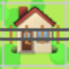
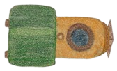

# Happy Train 🚂

A puzzle-based train simulator game where each level presents a unique challenge to guide trains to their destinations safely.

### [Direct link to the game](http://dmitryweiner.github.io/happy-train)

## 🎮 Game Overview

Happy Train is a browser-based puzzle game that combines strategic thinking with railroad management. Players control switches and semaphores to guide trains through complex track layouts, avoiding derailments and ensuring safe arrival at destination stations.

## ✨ Features

### Core Gameplay
- **Puzzle-based levels**: Each level is a unique challenge with different track layouts
- **Switch control**: Click on switches to change track directions
- **Semaphore management**: Control traffic lights to stop and start trains
- **Multiple trains**: Some levels feature multiple trains that must be coordinated
- **Collision avoidance**: Prevent train crashes and derailments
- **Progressive difficulty**: Levels increase in complexity

### Technical Features
- **HTML5 Canvas rendering**: Smooth graphics with pixel art aesthetic
- **Progress saving**: Game automatically saves your current level
- **Pause functionality**: Game pauses when window loses focus
- **Level editor**: Built-in editor for creating custom levels
- **Visual testing**: Comprehensive test suite for graphics consistency
- **Responsive design**: Optimized for desktop browsers

## 🕹️ How to Play

### Controls
- **Click switches**  to change track directions
- **Click semaphores**  to stop/start trains
- **Click level number** to pause/unpause the game

### Objectives
1. Guide the train(s) to the destination station 
2. Avoid derailments and collisions
3. Use switches to direct trains along the correct path
4. Control semaphores to manage train timing
5. Complete all levels to win!

### Game Elements
- **Locomotive** : The engine that pulls the train
- **Wagons**  : Cargo cars attached to the locomotive
- **Switches**: Junction points where tracks split - click to toggle direction
- **Semaphores**: Traffic signals that can stop trains when closed
- **Stations**: Destination points where trains must arrive

## 🚀 Getting Started

### Prerequisites
- Modern web browser with HTML5 Canvas support
- Desktop environment recommended (mobile warning displayed)

### Installation
1. Clone or download the repository
2. Open `index.html` in your web browser
3. Click "PLAY" to start the game

### Development Setup
```bash
# Install dependencies
yarn install

# Run tests
yarn test

# Run visual tests
yarn test:visual
```

## 🛠️ Project Structure

```
happy-train/
├── index.html          # Main game file
├── editor.html         # Level editor
├── game.js            # Core game logic
├── graphics.js        # Rendering engine
├── levels.js          # Level definitions
├── constants.js       # Game constants
├── utils.js           # Utility functions
├── storage.js         # Save/load functionality
├── styles.css         # Game styling
├── editor.css         # Editor styling
├── assets/            # Game graphics
│   ├── locomotive.png
│   ├── wagon1.png
│   ├── wagon2.png
│   ├── semaphore.png
│   ├── station.png
│   ├── switch.png
│   ├── fog.png
│   └── winner.gif
├── tests/             # Unit tests
└── visual-tests/      # Visual regression tests
```

## 🎨 Level Editor

The game includes a built-in level editor accessible via `editor.html`:

### Features
- **Track placement**: Draw rails, curves, and switches
- **Object placement**: Add semaphores, stations, and trains
- **Configuration export**: Generate level data in JSON format
- **Visual preview**: Real-time preview of your level
- **Import/Export**: Save and load custom levels

### Usage
1. Open `editor.html` in your browser
2. Select tools from the toolbar
3. Click on the grid to place elements
4. Configure level settings in the right panel
5. Export your level configuration

## 🧪 Testing

The project includes comprehensive testing:

### Unit Tests
- Switch logic validation
- Utility function testing
- Game state management

### Visual Tests
- Rendering consistency checks
- Asset comparison testing
- Cross-browser compatibility

Run tests with:
```bash
npm test
```

## 🎯 Game Mechanics

### Train Movement
- Trains automatically accelerate and move along tracks
- Speed is limited by curves and track conditions
- Trains can be stopped by closed semaphores
- Collisions result in game over

### Switch Logic
- Switches have two states: straight and turn
- Cannot be changed while a train is on the switch
- Default state is "straight"
- Visual feedback shows current switch position

### Level Progression
- Complete levels sequentially
- Progress is automatically saved
- Final level shows victory animation
- Can restart from any completed level

## 🔧 Configuration

Game constants can be modified in `constants.js`:
- Grid dimensions (15x10 cells by default)
- Cell size (40px)
- Train speed and acceleration
- Rendering parameters

## 🤝 Contributing

Contributions are welcome! Areas for improvement:
- New level designs
- Additional game mechanics
- Mobile optimization
- Performance enhancements
- Accessibility features

## 📜 License

This project is licensed under the GNU License - see the [LICENSE](LICENSE) file for details.

## 👤 Author

Created by [Dmitry Weiner](https://github.com/dmitryweiner/)

## 🔗 Links

- [The Game](http://dmitryweiner.github.io/happy-train)
- [Source Code](https://github.com/dmitryweiner/happy-train)
- [Author's GitHub](https://github.com/dmitryweiner/)

---

*All aboard the Happy Train! 🚂💨*
